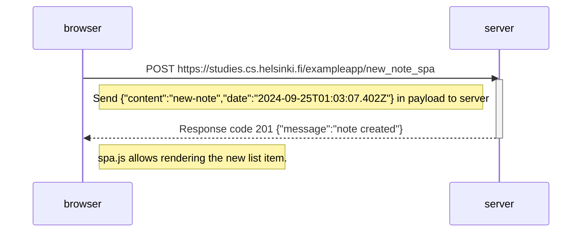

### **0.6: Nueva nota en diagrama de aplicación de una sola pagina**

Crea un diagrama que represente la situación en la que el usuario crea una nueva nota utilizando la versión de una sola página de la aplicación.

