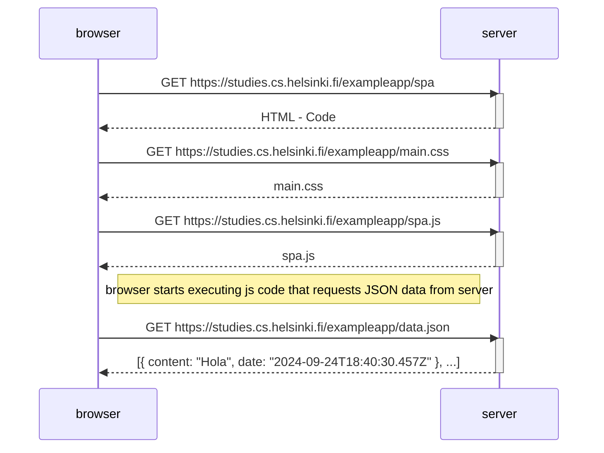

### **0.5: Diagrama de aplicación de una sola página**

Crea un diagrama que describa la situación en la que el usuario accede a la versión de [aplicación de una sola página](https://fullstackopen.com/es/part0/fundamentos_de_las_aplicaciones_web#aplicacion-de-una-sola-pagina) de la aplicación de notas en https://studies.cs.helsinki.fi/exampleapp/spa.

